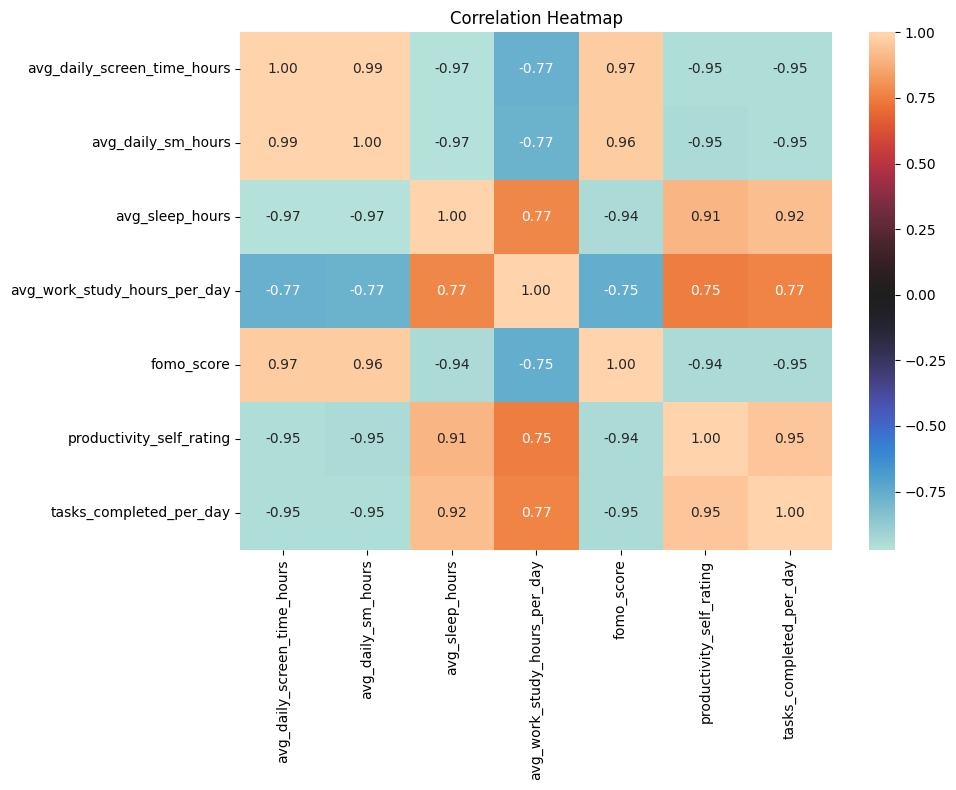
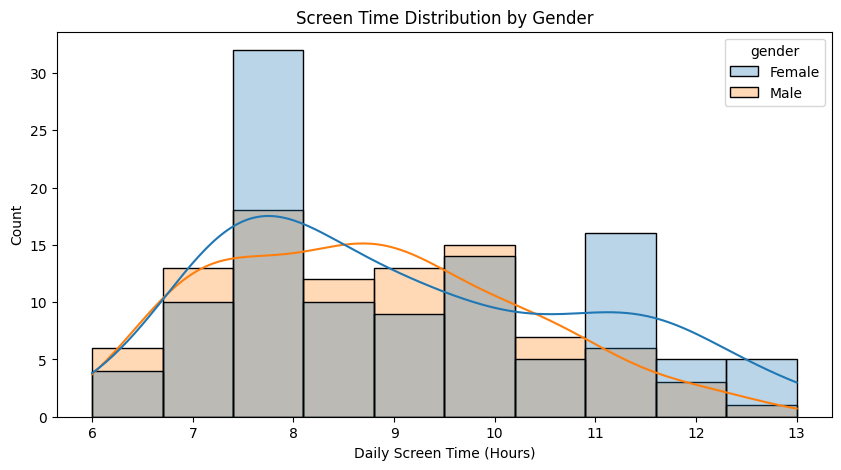
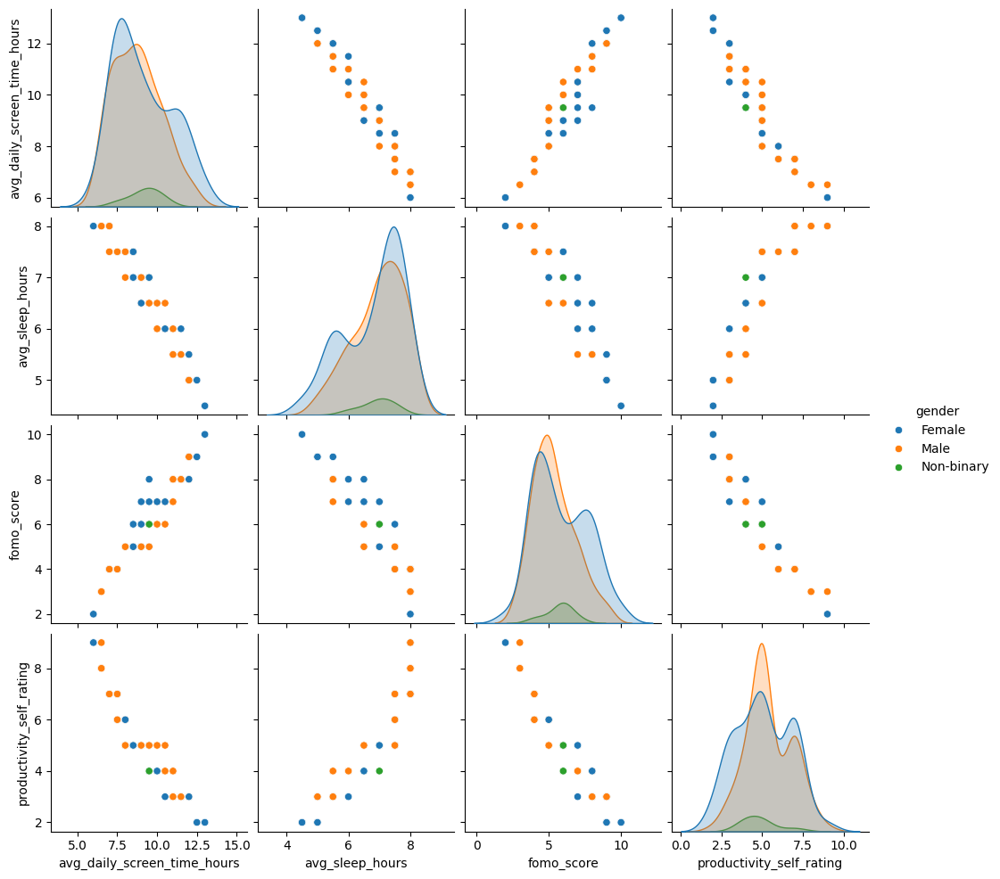
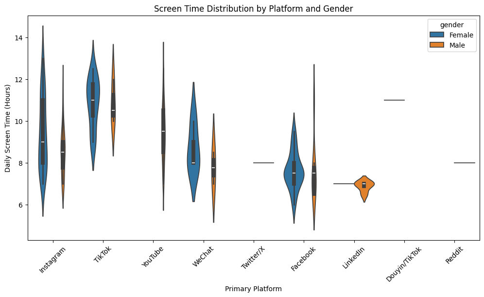
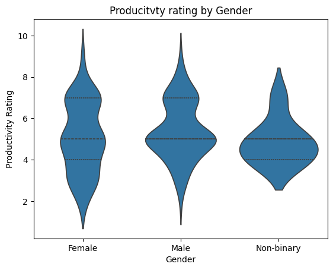

# Analisis Social Media, Dopamine, dan Productivity

Project ini merupakan latihan **Data Analysis dan Data Visualization** menggunakan Python dan Seaborn untuk mengeksplorasi hubungan antara penggunaan media sosial, screen time, faktor terkait dopamin, tidur, dan produktivitas.

Analisis dilakukan menggunakan dataset sintetis dengan pendekatan **Exploratory Data Analysis (EDA)** dan visualisasi data.

---

## Tujuan Project

Project ini bertujuan untuk:

- Memahami struktur dan karakteristik dataset.
- Melakukan data cleaning dan data quality checking.
- Melakukan Exploratory Data Analysis (EDA).
- Menganalisis distribusi variabel numerik dan kategorikal.
- Menganalisis hubungan antar variabel.
- Melatih penggunaan Seaborn untuk visualisasi data.
- Mengidentifikasi pola dan hubungan yang terdapat dalam dataset.

---

## Visualisasi

### Correlation Heatmap

### Distribution Analysis

### Relationship Analysis

### Distribution Comparison

---

## Dataset

Dataset yang digunakan adalah:

**Social Media Dopamine and Productivity Dataset**

Dataset berisi **300 observasi dan 66 variabel** yang berkaitan dengan penggunaan media sosial, screen time, tidur, produktivitas, FOMO, dan beberapa indikator perilaku lainnya.

Dataset bersifat **sintetis**, sehingga hasil analisis tidak dimaksudkan untuk merepresentasikan populasi dunia nyata.

Sumber dataset:

[Kaggle - Social Media Dopamine and Productivity Dataset](https://www.kaggle.com/datasets/manaswinsripatnala/social-media-dopamine-and-productivity-dataset/data)

---

## Tools & Libraries

Project ini menggunakan:

- Python
- Pandas
- NumPy
- Matplotlib
- Seaborn
- Jupyter Notebook

---

## Tahapan Analisis
Data Understanding
        ↓
Data Quality & Cleaning
        ↓
Exploratory Data Analysis
        ↓
Univariate Analysis
        ↓
Bivariate Analysis
        ↓
Multivariate Analysis
        ↓
Data Visualization